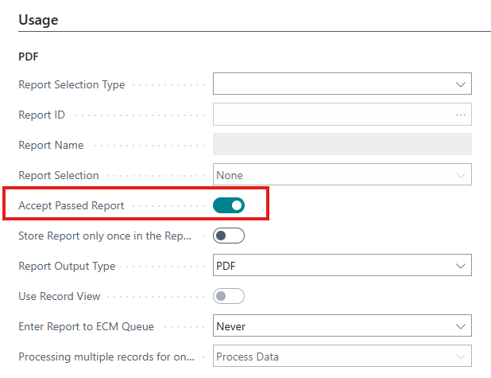
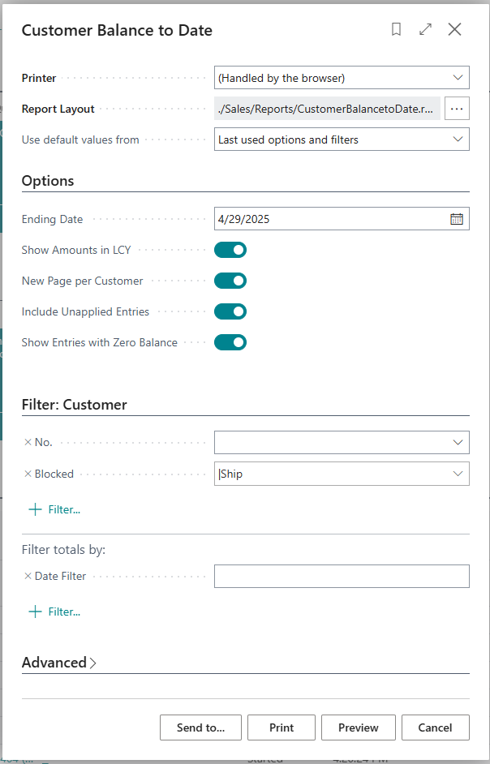
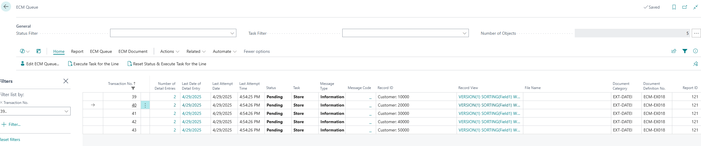
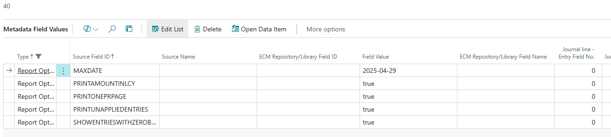

To save report request page or other values, the report can be stored manually on run ([see here](../ManualStoreReportWithRequestOptions/)) or the ECM Queue Entry can be created with the variable data stored in metadata and reprinted at a later time.

Setup Document Definition

Run Report

ECM Queue per Record

ECM Queue Metadata

