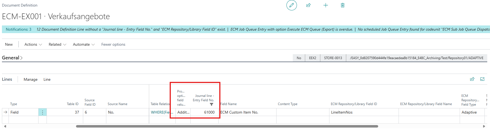
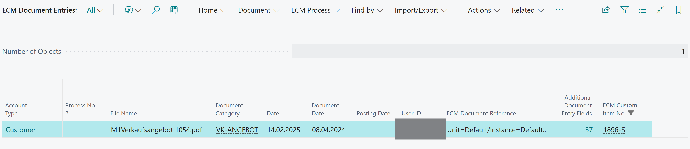

To add a custom field to the document entries, you need to add the field to 4 tables:

1. ECM Document Journal Line
2. ECM Document Entry
3. ECM Document Reversal Entry
4. ECM Document Entry Buffer (used to display as Source Record in the default FactBox)

For example we added the item no. here as a multiple field in the ECM Document Definition:

The results looks like this in the ECM Document Entry:

To filter on document entries, you can embed the document entry factbox with custom filters as shown in the ["CustomerFactBox" example](/CustomerFactBox/readme.md).