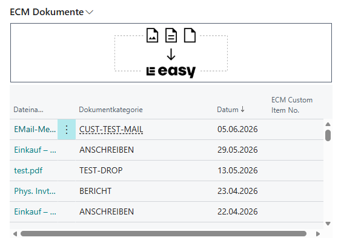

# Custom Mail Document Category

This example shows how to assign a custom ECM **Document Category** to a document at the moment it is emailed, without permanently changing the document definition setup.

## [`ECMCustomPOMailCat.PageExt.al`](./ECMCustomPOMailCat.PageExt.al)

A page extension (`ECM Cust. IO Mail Cat.`, ID `61009`) on the **Purchase Order** page that adds a *Send by Email with Custom Category* action to the processing actions.

When the action is triggered it:

1. Ensures an `ECM Document Category` with code `CUST-TEST-MAIL` exists, creating it on the fly if needed.
2. Calls `SetCategory` on the `ECM Custom Document Category` codeunit (ID `61007`) to remember the category to apply.
3. Binds that codeunit as a manual event subscriber, so its subscription becomes active only for this operation.
4. Runs `Document-Print.EmailPurchHeader(Rec)` to email the purchase order.
5. Unbinds the subscription so the override no longer affects subsequent operations.

The subscriber ([`ECMCustomDocumentCategory.Codeunit.al`](./ECMCustomDocumentCategory.Codeunit.al)) listens to `ECM API.OnAfterFindDocDefByRRef` and, when a document definition is found, overrides its `Document Category` with the previously set value. This routes the emailed document into the desired category in ECM.

## Result

The emailed purchase order is stored in ECM under the custom `CUST-TEST-MAIL` category, as shown in the ECM Documents FactBox:

