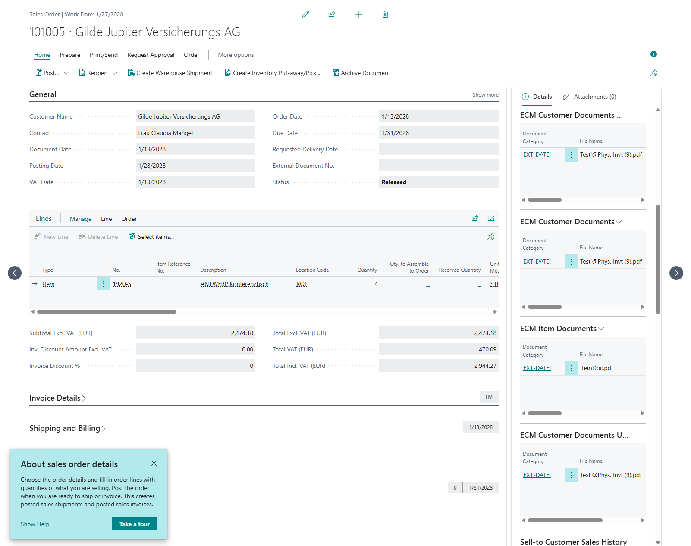

# Customer FactBox

Shows how to add custom filtered ECM document FactBoxes to the **Sales Order** page using the existing FactBox pages from the ECM Base Application.

The page extension `ECM Cust. Sales Order` adds four FactBox parts after the standard `ECMdocs` FactBox. All parts use `ECM FactBox UI` = **Records Only** (via `SetECMDocEntryPrimaryFilter`) so the drop area is hidden.

Related example for documents of the **selected sales line** (via `Provider` + `SubPageLink` on `SystemId`): [LineFactBox](../LineFactBox/).

## Options demonstrated

### 1. ECM Customer Documents With Link

- **Page:** `ECM Doc.Entries Buffer FactBox`
- **Binding:** `SubPageLink` on `Table ID` = `Customer` and `Account No.` = Sell-to Customer No.
- **Drop / assign:** Yes — the linked customer record is resolved via the page link and the object reference matrix setup.
- **Use when:** You want a buffered FactBox filtered by a related account and still allow attaching documents.

```al
part(ECMCustomCustomerDocsWithLink; "ECM Doc.Entries Buffer FactBox")
{
    Caption = 'ECM Customer Documents With Link';
    UpdatePropagation = SubPart;
    SubPageLink = "Table ID" = const(Database::Customer), "Account No." = field("Sell-to Customer No.");
}
```

### 2. ECM Customer Documents (view only)

- **Page:** `ECM Doc.Entries Buffer FactBox`
- **Binding:** No `SubPageLink`. On `OnAfterGetCurrRecord`, filter `ECM Document Entry` by customer and pass the view with `SetECMEntryView`, then call `InitECMEntryBuffer` / `Update`.
- **Drop / assign:** No — there is no linked source record for attach/drop.
- **Use when:** You only need to display document entries matching a custom filter.

```al
ECMDocumentEntry.SetRange("Account Type", ECMDocumentEntry."Account Type"::Customer);
ECMDocumentEntry.SetRange("Account No.", Rec."Sell-to Customer No.");
CurrPage.ECMCustomCustomerDocsWithView.Page.SetECMEntryView(ECMDocumentEntry);
CurrPage.ECMCustomCustomerDocsWithView.Page.InitECMEntryBuffer();
CurrPage.ECMCustomCustomerDocsWithView.Page.Update(false);
```

### 3. ECM Item Documents

- **Page:** `ECM Doc.Entries Buffer FactBox`
- **Binding:** No `SubPageLink`. On `OnAfterGetCurrRecord`, resolve the first item line of the sales order and pass the item with `LoadDataFromRecord`.
- **Drop / assign:** Yes — the record is passed to the FactBox by code.
- **Use when:** The FactBox should show documents for a related record that is not the page source (here: an item from the sales lines).

```al
CurrPage.ECMCustomItemDocs.Page.LoadDataFromRecord(Item);
```

### 4. ECM Customer Documents Unbuffered

- **Page:** `ECM Doc Entries FactBox` (non-buffered)
- **Binding:** `SubPageLink` on `Account No.` = Sell-to Customer No. and `Account Type` = Customer.
- **Drop / assign:** Depends on the unbuffered FactBox behavior; does **not** use temporary buffer records.
- **Use when:** You prefer the classic (non-buffer) FactBox with a direct account link.

```al
part(ECMCustomCustomerDocsUnbuffered; "ECM Doc Entries FactBox")
{
    Caption = 'ECM Customer Documents Unbuffered';
    UpdatePropagation = SubPart;
    SubPageLink = "Account No." = field("Sell-to Customer No."), "Account Type" = const(Customer);
}
```

## Common setup (`OnOpenPage`)

Every FactBox part receives:

1. `SetPageID(CurrPage.ObjectId(false))` — page context for ECM setup / matrix.
2. `SetECMDocEntryPrimaryFilter` with `"ECM FactBox UI"::"Records Only"` — hide the drag-and-drop area.

## Screenshots

Sales Order with the four example FactBoxes (including **ECM Item Documents** with an item file):



Close-up of the FactBox pane (Customer With Link, Customer view-only, Item via `LoadDataFromRecord`, Customer unbuffered):


