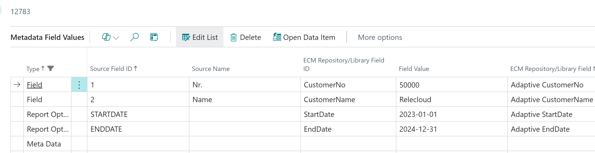

To archive a report by code with custom request page, you need to manually run the report and save the blob. To only add report options and run the report generation with ECM Queue, ([see here](../AddReportRequestOptions/))

Setup Document Definition Line

Run Report

Result
