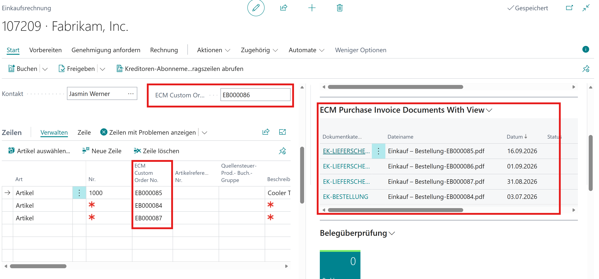

# Purchase Invoice With View FactBox

Shows how to add a custom **ECM Doc.Entries Buffer FactBox** to the **Purchase Invoice** page that lists documents of related purchase orders — not only the invoice itself.

The page extension `ECM Custom Purchase Invoice` adds the FactBox after the standard `ECMdocs` part. It uses `ECM FactBox UI` = **Records Only** (via `SetECMDocEntryPrimaryFilter`) so the drop area is hidden. `LoadDataFromRecord` still binds the invoice as the source record for assign/drop.

Related FactBox patterns:

- Header / related-account variants on Sales Order: [CustomerFactBox](../CustomerFactBox/)
- Documents of the selected line (`Provider` + `SubPageLink`): [LineFactBox](../LineFactBox/)

## What is demonstrated

A purchase invoice can reference several purchase orders: one number on the header and further numbers on the lines. The FactBox builds an OR-filter from those values and passes it with `SetECMEntryView`, so all matching ECM document entries appear in one list.

In the screenshot below, header order **EB000086** plus line orders **EB000085**, **EB000084**, and **EB000087** drive the FactBox. The list then shows the archived files for those document numbers.

## Custom fields

`ECM Custom Order No.` is added on **Purchase Header** and **Purchase Line** and shown on the invoice card and the purch. invoice subform. These fields are the keys used to find related ECM document entries (`Document No.`).

```al
field(61001; "ECM Custom Order No."; Code[20])
{
    Caption = 'ECM Custom Order No.';
    DataClassification = CustomerContent;
}
```

## FactBox part

- **Page:** `ECM Doc.Entries Buffer FactBox`
- **Binding:** No `SubPageLink`. On `OnAfterGetCurrRecord`, filter `ECM Document Entry` by `Document No.` and pass the view with `SetECMEntryView`. Then call `LoadDataFromRecord` for the invoice.
- **Drop / assign:** Yes — the purchase invoice is passed to the FactBox by code. The drop area is hidden by **Records Only**.
- **Use when:** The FactBox should show documents for related records (here: purchase orders referenced on header and lines) while assign still targets the current page record.

```al
part(ECMCustomPurchaseInvoiceDocsWithView; "ECM Doc.Entries Buffer FactBox")
{
    ApplicationArea = All;
    Caption = 'ECM Purchase Invoice Documents With View';
    UpdatePropagation = SubPart;
}
```

## Setup (`OnOpenPage`)

The FactBox part receives:

1. `SetPageID(CurrPage.ObjectId(false))` — page context for ECM setup / matrix.
2. `SetECMDocEntryPrimaryFilter` with `"ECM FactBox UI"::"Records Only"` — hide the drag-and-drop area.

```al
TempECMDocEntryPrimaryfilter."ECM FactBox UI" := TempECMDocEntryPrimaryfilter."ECM FactBox UI"::"Records Only";

CurrPage.ECMCustomPurchaseInvoiceDocsWithView.Page.SetPageID(CurrPage.ObjectId(false));
CurrPage.ECMCustomPurchaseInvoiceDocsWithView.Page.SetECMDocEntryPrimaryFilter(TempECMDocEntryPrimaryfilter);
```

## Combined filter (`OnAfterGetCurrRecord`)

The filter text is the header `ECM Custom Order No.` plus every non-empty line `ECM Custom Order No.`, joined with `|`. That filter is applied to `ECM Document Entry."Document No."` and passed to the FactBox.

```al
FilterTextBuilder.Append(Rec."ECM Custom Order No.");

PurchaseLine.SetRange("Document Type", Rec."Document Type");
PurchaseLine.SetRange("Document No.", Rec."No.");
PurchaseLine.SetLoadFields("ECM Custom Order No.");
if PurchaseLine.FindSet() then
    repeat
        if PurchaseLine."ECM Custom Order No." <> '' then
            if FilterTextBuilder.Length() = 0 then
                FilterTextBuilder.Append(PurchaseLine."ECM Custom Order No.")
            else
                FilterTextBuilder.Append('|' + PurchaseLine."ECM Custom Order No.");
    until PurchaseLine.Next() = 0;

ECMDocumentEntry.SetFilter("Document No.", FilterTextBuilder.ToText());
CurrPage.ECMCustomPurchaseInvoiceDocsWithView.Page.SetECMEntryView(ECMDocumentEntry);
CurrPage.ECMCustomPurchaseInvoiceDocsWithView.Page.LoadDataFromRecord(Rec);
```

## Screenshots

Purchase Invoice with custom order numbers on header and lines, and the FactBox listing the related ECM documents:


